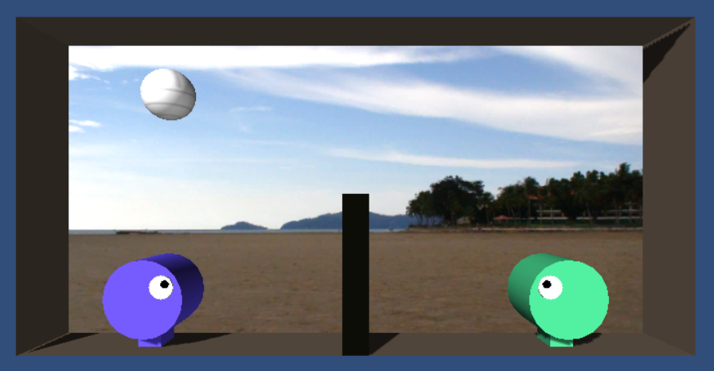

## Arcade Volleyball

Unity 3D-engine with F#-programming language

This is multi-platform game for two players.
You can play it with touchscreen or keyboard:
 * Player-1 have Arrow-keys (Left,Right,Up), Player-2 has A,W,D
 * Touchscreen: Touch left/right side of your screen to move, the upper half of your side to jump.

This is simple version, so there is no limitations yet:
 * Only the serving player can score on each volley 
 * Unlimited score
 * Unlimited touches to ball
 * No computer player implemented (yet), so only 2-player mode.
 
This game is created with Unity (3d) game engine and Visual Studio (F-Sharp).

Paragon games: http://en.wikipedia.org/wiki/Arcade_Volleyball

 * Windows tested, works correctly.
 * Mac tested, works correctly.
 * WebPlayer tested, works correctly.
 * Android tested, works correctly.
 * iOS not tested, builds fine.
 * Windows Phone build fails.
 * Windows Store build fails.

Windows Phone build fails:

 + Microsoft.FSharp.Text.StructuredPrintfImpl.Layout
System.NullReferenceException: Object reference not set to an instance of an object.
   at Unity.CecilTools.Extensions.TypeReferenceExtensions.IsEnum(TypeReference type)

Windows Store build fails:

[FSharp.Core]Microsoft.FSharp.Collections.Array2DModule+MapIndexed@119' has an extra field 'array' of type 'T[,]' in the player and thus can't be serialized
UnityEditor.HostView:OnGUI()

Play on-line: http://thorium.github.io/Volleyball

Or get free from Google Play Android store: https://play.google.com/store/search?q=Arcade%20Volleyball&hl=en
